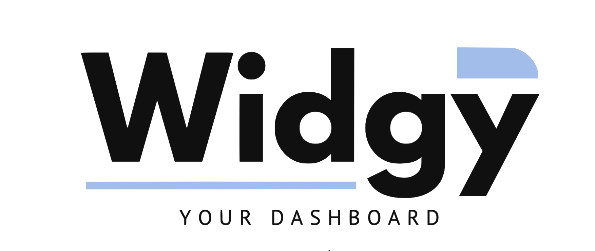

# Widgy - Your dashboard

Ce README présente les membres de l'équipe projet, la description du projet réalisé, la documentation permettant le lancement du projet, les quelques difficultés rencontrées et le lien de notre Trello permettant la répartition du travail :

## Membres de l'équipe projet

Le projet Widgy, comprenant Frontend et Backend, a été réalisé par <b>Jules Lestrade</b> et <b>Mickaël Gremy</b>. Nous sommes, tous les 2, issus du Master 1 orienté Objets Connectés, Réseaux et Services au sein de l'ECE Paris. Ce projet est en lien avec notre mentor et professeur de technologies Web <b>Adrien Kourganoff</b>, lui même, issu de cette même formation.

## Description du projet réalisé

Notre projet est un dashboard regroupant <b>7 widgets différents</b> :

- Un <b>indicateur boursier</b> permettant de visualiser le cours des actions de grandes entreprises (Amazon, Apple, Facebook, Google, Microsoft) ;
- Un <b>indicateur météolorogique</b> permettant de visualiser la météo d'une ville donnée pour aujourd'hui et les 3 jours suivants. La ville par défaut est Los Angeles ;
- Un <b>indicateur épidémiologique</b> permettant de suivre quotidiennement les statistiques du Covid-19, notamment le nombre de personnes contaminées, décédées et rétablies du Coronavirus ;
- Un <b>indicateur national</b> permettant rapidement de visualiser les principales informations d'un pays donné (Pays, Capitale, Démographie, Superficie) ;
- Un <b>indicateur de gros titres</b> permettant de visualiser, en temps réel, les 3 informations nationales essentielles de différents journaux ;
- Un <b>historique des hospitalisations</b> dûes au Covid-19 aux Etats-Unis. Ce widget reprend la librairie Recharts qui offre l'affichage de graphiques et est actualisé quotidiennement.

Notre dashboard propose de nombreux contenus et vise les chefs d'entreprise ayant besoin de données en temps réel : les statistiques du Covid-19 peuvent influencer l'ensemble des autres widgets : un confinement pourrait changer le cours des actions ou la météo par exemple. De même, cette pandémie revient très souvent aux informations nationales et pourrait nécessiter une surveillance accrue des derniers articles parus.

## Lancement du projet

Le projet a été conçu en ReactJS et utilise NodeJS. Afin de permettre un lancement correct de notre projet, veuillez suivre les instructions si dessous :

- Pour la partie <b>Frontend</b>, veuillez lancer votre terminal et rendez-vous dans le dossier frontend du dossier PROJECT-WEB-OCRES via la commande <i>cd</i>. Installez NodeJS en saisissant <i>npm install</i> puis lancer le navigateur internet en localhost avec <i>npm start</i> ;

- Pour la partie <b>Backend</b>, après avoir lancé la partie frontend de notre projet, ouvrez une nouvelle fenêtre de votre terminal et rendez-vous dans le dossier backend du dossier PROJECT-WEB-OCRES via la commande <i>cd</i>. Enfin, installez NodeJS en saisissant <i>npm install</i> puis lancer le navigateur internet en localhost avec <i>npm start</i>.

## Difficultés rencontrées

Comme dans la plupart des projet qui viennent d'être créé, de nombreuses difficultés peuvent apparaître notamment lors de la phase de lancement.

Il nous fallait, tout d'abord, comprendre ce qui nous était demandé et surtout organiser le travail qu'il était nécessaire d'effectuer. La tâche la plus difficile à été de réaliser le premier widget, comprendre l'appel à une API, récupérer les informations envoyées par celle-ci.

Une fois cette étape réalisée, les tâches suivantes ont été plus simple et ce projet nous a permis de comprendre un nouvel langage qu'était le ReactJS. Nous sommes fiers, aujourd'hui, de vous le présenter.

## Répartition du travail

Un projet réussi est structuré et organisé de façon à répartir les différentes tâches à réaliser entre les différents membres. Afin de visualiser l'ensemble du travail effectué et la répartition des tâches entre membres de l'équipe projet, rendez-vous sur le <b>Trello de Widgy</b> ci-joint : 

 <a href="https://trello.com/b/Hjukhlm3/widgy">Trello de Widgy</a>

